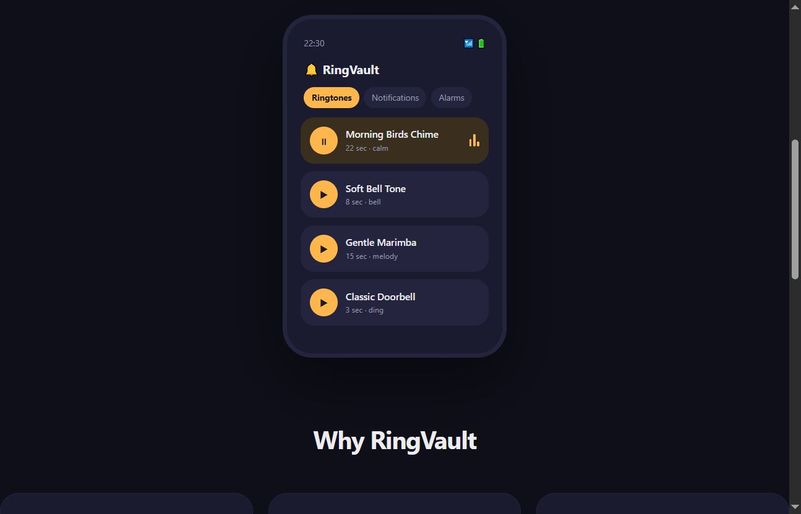

# RingVault

> Free ringtones, notifications & alarms for Android. No ads, no subscriptions.

[](https://ringvault.vercel.app/)
[](https://ringvault-api-0wbw.onrender.com/health)
[](https://github.com/TPAINN/ringvault/releases)
[](LICENSE)



---

Curated free ringtones, notification sounds & alarms for Android. Preview instantly, set with one tap. Every sound is CC0, public domain or CC-BY — legally free forever. Weekly automated pipeline keeps the library fresh.

## Features

- Browse & preview hundreds of curated sounds
- Set directly as ringtone / notification / alarm via MediaStore
- All sounds CC0 / CC-BY — no copyright issues
- Weekly automated ingest (Freesound + Pixabay)
- No ads, no login, no subscriptions

## Stack

| Layer | Tech |
|---|---|
| Android | Kotlin · Jetpack Compose · ExoPlayer |
| Backend | Node.js · Express · MongoDB |
| Ingest | Automated weekly cron (Freesound + Pixabay) |
| Deploy | Vercel (landing) · Render (API + cron) |

## Quick start

**Backend:**
```bash
cd backend
npm install
cp .env.example .env   # MONGO_URI, FREESOUND_API_KEY, PIXABAY_API_KEY
npm run dev            # http://localhost:5000
npm run ingest         # populate DB
```

**Android:** Open `android/` in Android Studio (Ladybug+, JDK 17) → Run.

```bash
cd android
./gradlew installDebug
./gradlew assembleRelease   # signed APK
```

API keys: [Freesound](https://freesound.org/apiv2/apply/) · [Pixabay](https://pixabay.com/api/docs/)

## API

```
GET  /api/sounds
GET  /api/sounds/:id
GET  /api/sounds/search?q=
POST /api/sounds/:id/download
GET  /api/meta/categories
GET  /health
```

## License

MIT
